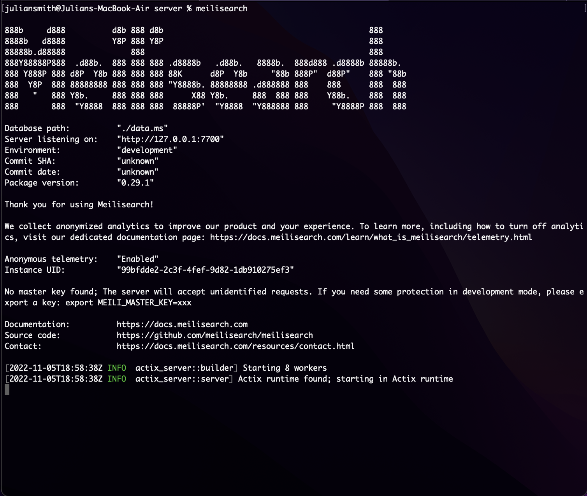

# Getting Started with Tando Taco Server

## Environment Setup for Tandem Taco Client

This project is the server side of Tandem Taco.

Cors is already set up for the backend to communicate to the client through HTTP request.

#### Installing Meilisearch

To help with creating a seamless search experience, I used a search engine called Meilisearch. To use this project, you have to install it on your local machine using homebrew on Mac:

#### Update brew and install Meilisearch

In your terminal, run the command:

`brew update && brew install meilisearch`

After it is installed, get the Meilisearch server up and running by typing this command in your termal:

`meilisearch`

After running the command, you should see Meilisearch start up in the terminal window



Ruby version:

```
3.0.0
```

Rails version:

```
7.0.4
```

To install the packages for this project, run the command:

```
bundle install
```

To start the server and spin up Tandem Taco Server, run:

```
rails s
```

## Tech Stack

Rails <br/>
Postgres <br/>
Meilisearch

# README

This README would normally document whatever steps are necessary to get the
application up and running.

Things you may want to cover:

- Ruby version

- System dependencies

- Configuration

- Database creation

- Database initialization

- How to run the test suite

- Services (job queues, cache servers, search engines, etc.)

- Deployment instructions

- ...
